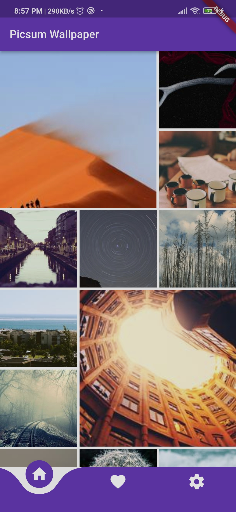
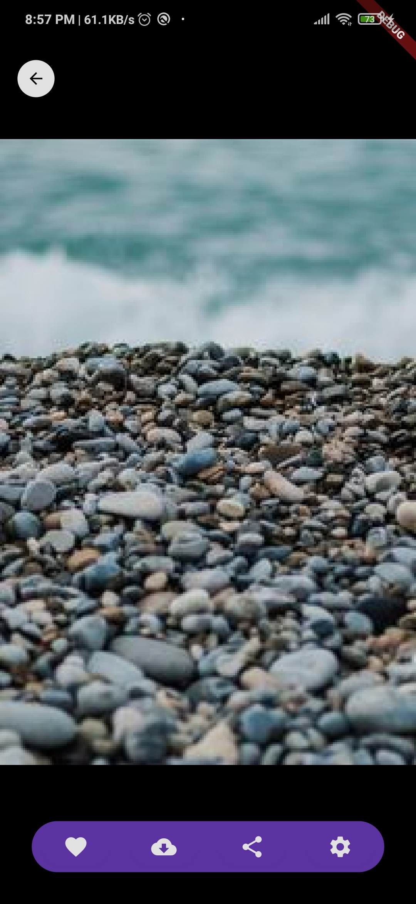
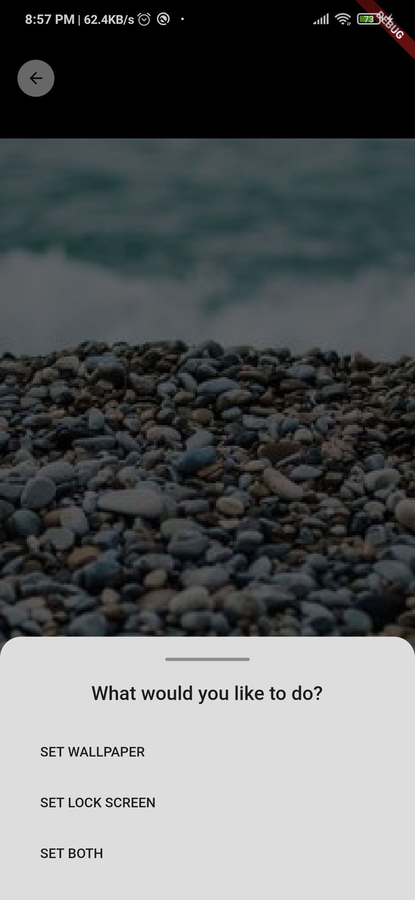
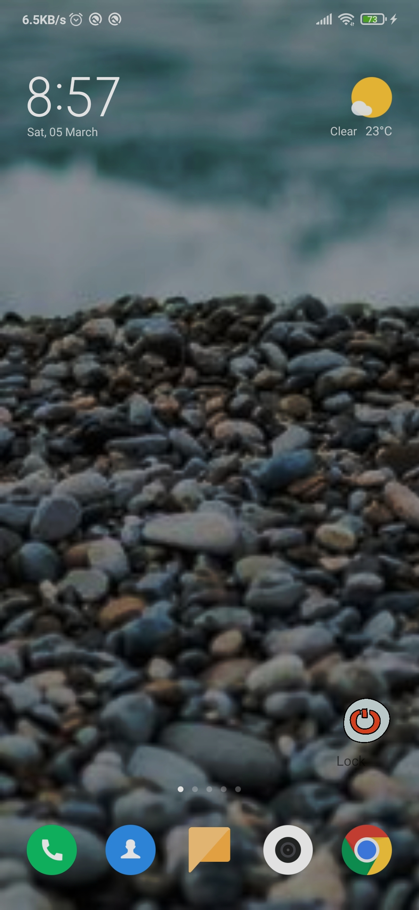

# Flutter-Picsum-Wallpaper

 

 

[Download Apk](https://drive.google.com/file/d/1l6GJlOErwJ68ULXP1Re1xFKlKlivKVi9/view?usp=sharing)

## Project Features

The features I'm implemented. Those are -

- [View Image on Tap]
- [Image zoom]
- [Download Image]
- [Share Image]
- [Wallpaper set on Lock, Home screen]

 

## Dependencies

- Provider (For state management)
- Flutter Staggered GridView
- Cached network image
- Curved navigation bar
- Shimmer
- Flutter Toast
- Photo View
- Wallpaper manager flutter
- Image downloader
- Animate do
- HTTP

 

## Picsum Screenshots App

